background-image: url("./_imgs/logos.png")
background-size: 90%, cover

```{r setup, include=FALSE}
options(htmltools.dir.version = FALSE)
library(xaringanExtra)
xaringanExtra::use_panelset()
xaringanExtra::style_panelset_tabs(font_family = "inherit")
```

???

---
class: inverse, center, middle

# Virtual Mobility

---
```{r map, echo=FALSE, warning=FALSE}
library(leaflet)

df <- data.frame(
  local = c("FPZ", "FPZ b70", "USP-Poli", "USP-EESC", "USP-EESC-2"),
  lat = c(45.8158148005203, 45.81354142793231, -23.56124940021321, -22.00222260870379, -22.0008),
  lng = c(16.00964570242656, 16.041231467207428, -46.73076002513203, -47.89868350725889, -47.9297 )
)

leaflet(df, width="100%") %>%
  addTiles() %>%  
  #addCircleMarkers(lng=~lng, lat=~lat, popup=~local, color=~color, fill = TRUE)
  addMarkers(lng=~lng, lat=~lat, popup=~local)

```

website: [USP](https://www5.usp.br/#english)


---
class: inverse, center, middle

# Get Started

---

## Concepts

.pull-left[
```{r, out.width='95%', fig.align='left', echo=FALSE}
knitr::include_graphics('_imgs/ai.jpg')

```

  <!--  -->
  .footnote[
  Image credit: [vask3](https://vas3k.com/blog)
  ]
]

--
.pull-right[
- **|AI| Artificial Intelligence**: </br>a whole knowledge field

- **|ML| Machine Learning**: </br>is a part of AI, but not the only one

- **|NN| Neural Networks**: </br>one of the machine learning types

- **|DP| Deep Learning**: </br>a modern method of building, training and using NN (a new architecture)
]

---
## Methods & Algorithms

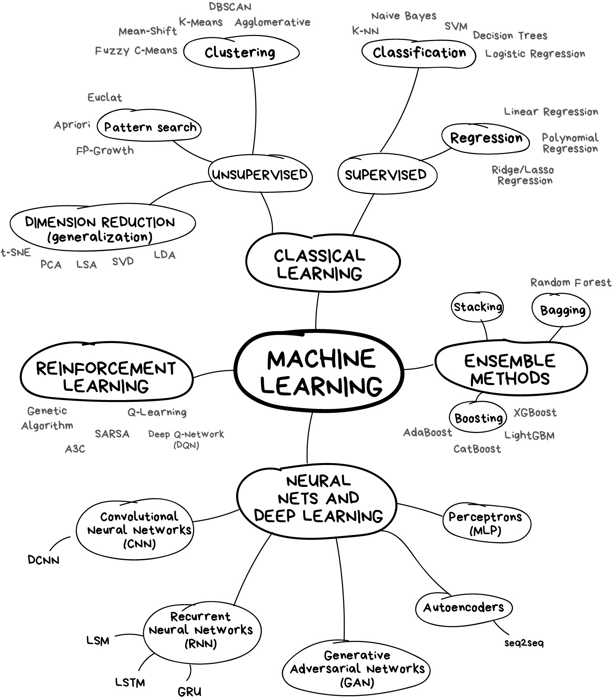

.pull-right[
.footnote[
Image credit: [vask3](https://i.vas3k.ru/7vx.jpg)
]
]


---
class: center, middle, inverse

# Genetic Algorithm [GA]

---
## Genetic Algorithm
.panelset[
.panel[.panel-name[Concept]

  .pull-left[
  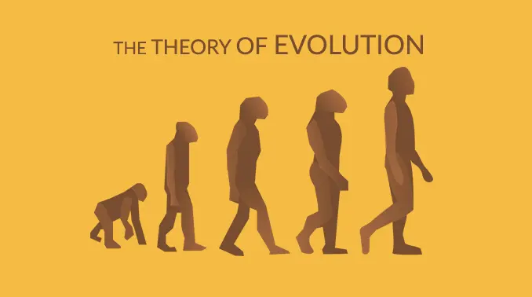
  
  Image credit: [EarthHow](https://earthhow.com/theory-of-evolution/)
  
  ]
  
  .pull-right[
  
  > GAs are stochastic search algorithms inspired by principles of biological and natural selection.
  >
  > .right[--[*John H. Holland* (1984)](https://link.springer.com/chapter/10.1007/978-1-4684-8941-5_21)]
  
  </br>
  
  > GAs simulate the evolution of living organisms, where the fittest individuals dominate over the weaker ones, by mimicking the biological mechanisms of evolution, such as selection, crossover and mutation.
  >
  > .right[-- [[STRUCCA, 2021](https://cran.r-project.org/web/packages/GA/vignettes/GA.html)]]
  
  ]
]

.panel[.panel-name[Algorithm]

  .pull-left[
  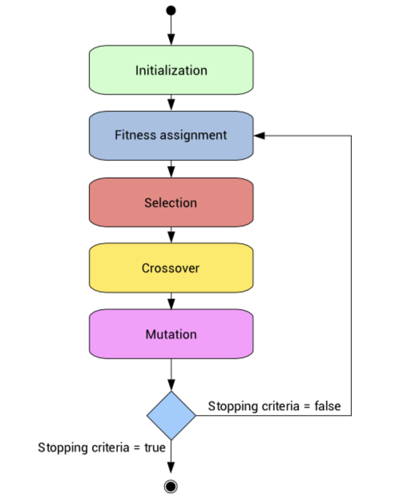
  
  Image credit: [RPubs](https://rpubs.com/Argaadya/550805)
  
  ]

  .pull-right[
  
- Free for any kind of model:
  
  $$ y = f(\alpha_n , X_m)$$
  $$model = f(parameters, variables)$$
  
  $$min(Error) = g(model, data)$$
- Dataset:
  
  
  
  Image credit: [R4DS](https://r4ds.had.co.nz/tidy-data.html)
    
  ]
]

.panel[.panel-name[Elements]
  .pull-left[
    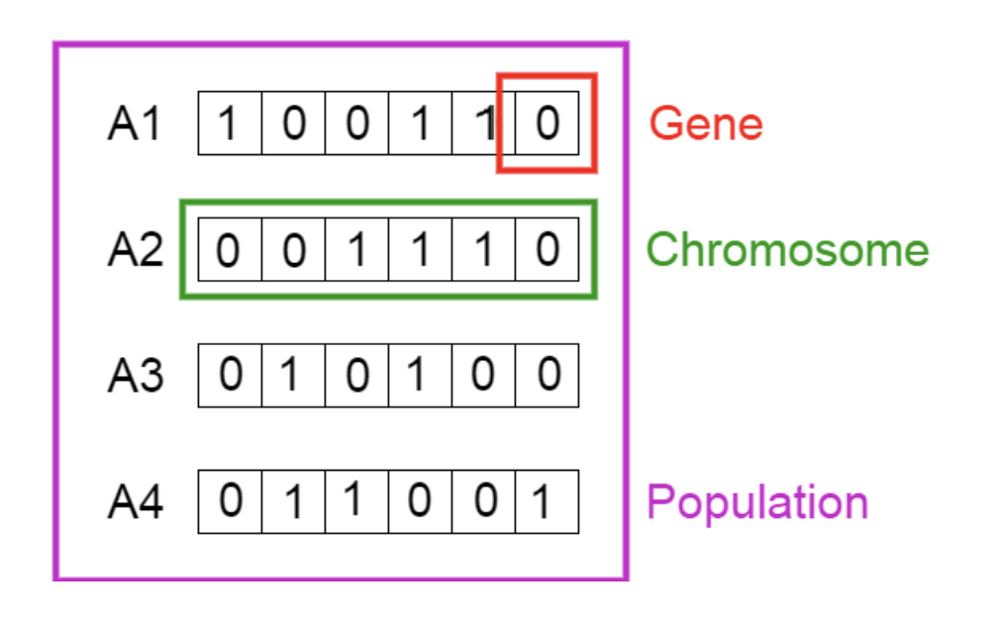
  ]
  
  .pull-right[
  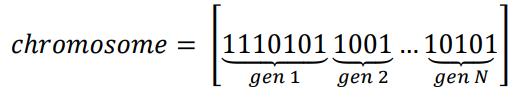
  
  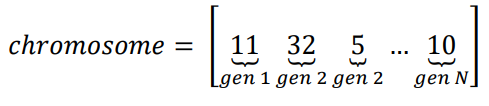
  ]

]


.panel[.panel-name[Operators]
.pull-left[
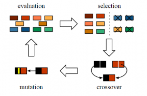

Image credit: [PapersWithCode](https://paperswithcode.com/method/ga#)
]


.pull-right[

Parameters to set:

- **Evaluation**: </br>'fitness function' - rank of the individuals [Hollander & Liu, 2008](https://doi.org/10.1007/s11116-007-9156-2)

- **Selection/Eletism**: </br>preserve the *n*-th best solutions

- **Crossover**: </br>mix the solutions

- **Mutation**: </br>change part of a solution

- **Predation**: </br>"diversity", eliminate *k* worst solutions and generate new ones randomly
  
]

]

]


---
class: center, middle, inverse

# Aplications of GA

---
## Examples in Transport Engineering
.panelset[
.panel[.panel-name[Research Team]
.pull-left[
  .pull-left[
  
  
  [**Prof. J.R. Setti**](https://scholar.google.com.br/citations?user=dhzpfA0AAAAJ) </br>[USP-EESC]
]
  .pull-rigth[
  
  
  [**Prof. A.L. Cunha**](https://scholar.google.com.br/citations?user=HI0CQJMAAAAJ) </br>[USP-EESC]
]

]
.pull-right[
  .pull-left[
  
  
  [**Prof. J.E. Bessa Jr.**](https://scholar.google.com.br/citations?user=wWeGz90AAAAJ) </br>[UFMG]
  ]
  
  .pull-right[
  
  
  [**Gustavo Riente**](https://scholar.google.com.br/citations?user=C2qGcW8AAAAJ) </br>McTrans Center, UFL
]

]
]

.panel[.panel-name[Brazilian road transport]
.pull-left[
```{r brazil, echo=FALSE, warning=FALSE}
library(leaflet)

leaflet(df, width="100%") %>%
  setView(lng=-46.73076002513203, lat=-23.56124940021321, zoom=4) %>% 
  #addProviderTiles(providers$Esri.NatGeoWorldMap)
  #addProviderTiles(providers$CartoDB.Positron)
  addTiles()
  
```
]

.pull-right[


- ~80% of the roads are Two-lane Highways

- ~60% of Brazilian cargo is transported by road

- Need for *Highway Capacity Manual* for Brazil
]
]
]

---
## Microscopic models calibration

.pull-left[

PREMISSES:

> Microscopic models are essential tools to the Transport engineer, however he/she needs specialized knowledge to specify how well the simulation is reproduced. 
>

</br>

> The use of simulation models without proper calibration results in planning and design errors.

]


.pull-right[
MODELS:

**Driver behavior:**

  - Car-following logic
  
  - Lane change logic

**Vehicle performance:**

  - Acceleration \ Deceleration
  
  - Emergency stop

]

---
### TRARR (TRAffic on Rural Roads)

.panelset[
.panel[.panel-name[Details]
Developed by *Australian Road Research Board* (ARRB), Transport Research Ltd, Australia.

- Simulation time step: 1.0s

- 7 fleet composition

- 18 different vehicles

- 18 driver profiles
]

.panel[.panel-name[GA]

- coded in Perl

- **25 parameters** calibrated

- Vehicle performance:
    - used 7 vehicles in 3 classes </br>(car, unit truck, articulated truck)
    - Weight
    - Lenght
    - Weight/Power ratio
    
- Driver behavior:
    - 7 drivers profile
    - Free Flow Speed
    - Speed factor reduction in auxiliary lanes

]

.panel[.panel-name[Result]

- Error drops from 9% to 6% using calibrated parameters

- Method to estimate traffic parameters from video camera (manually).

]

.panel[.panel-name[Publication]
- Egami, C.Y. [2000] ([Master](https://teses.usp.br/teses/disponiveis/18/18137/tde-30012018-110548/en.php))

- Egami, C.Y. [2006] ([PhD thesis](https://teses.usp.br/teses/disponiveis/18/18137/tde-10022011-105402/en.php)) 
]
]


---
### TWOPAS (TWO-lane with PASsing)

.panelset[

.panel[.panel-name[Details]
developed by *Midwest Research Institute* (MRI), *Federal Highway Administration* (FHWA), in USA.

- Simulation time step: 1.0s

- 13 different vehicles

- 10 driver profiles

]


.panel[.panel-name[GA]

- coded in Perl and Lua

- **35 parameters** calibrated

- Vehicle performance:
    - used 4 vehicles 
    - Weight/Power ratio
    
- Driver behavior:
    - 10 drivers profile
    - Free Flow Speed
    - Probability distribution of overtaking
    - Car-following factor
]

.panel[.panel-name[Result]
- Error drops from 9.5% to 6% using calibrated parameters

- Method to estimate traffic parameters from video camera (manually/automatic).
]

.panel[.panel-name[Publication]

- [2006] [Automatic Calibration of Two-Lane Highway Traffic Simulation Models Using Genetic Algorithm](https://ascelibrary.org/doi/abs/10.1061/40799%28213%2981).

- [2008] Mon-Ma, M.L. (PhD thesis)

- [2011] [Derivation of ATS and PTS function for Two-lane, Rural Highways in Brazil](https://www.sciencedirect.com/science/article/pii/S1877042811009967?via%3Dihub).
]
]


---
###INTEGRATION Dynamic Traffic Assignment and Simulation Software

.panelset[
.panel[.panel-name[Details]
developed by **Michael Van Aerde** and **Dr. Hesham Rakha**, at *Virginia Tech Transportation Institute* (VTTI), in USA. Simulate any type of highway (two-lane, multilane and freeway).

- Simulation time step: 0.1s

- 7 different vehicles

- 10 driver profiles

- Small version is available for download:</br>
[https://sites.google.com/a/vt.edu/hrakha/software](https://sites.google.com/a/vt.edu/hrakha/software)
]

.panel[.panel-name[GA]
- Coded in VBA-Excel and Lua

- **8 parameters** calibrated

- Vehicle performance:
    - 4 different vehicles 
    - Weight/Power ratio
    
- Fitness function:
    - MAER (Mean Absolute Error)

]

.panel[.panel-name[Truck model]
- Collect data:

    - GPS position of trucks at 10Hz (0.1s) travelling 10km on road
    - 62 trucks (5 light, 13 medium, 22 heavy, and 22 extra-heavy)

- Model:

$$F = m \cdot a $$
$$F_t = min(\eta \cdot 3600 \cdot \frac{P}{V}; W_{ta} \cdot \mu)$$
$$R_t = R_a + R_r + R_g$$
$$R_a = c_1 \cdot C_D \cdot C_h \cdot A \cdot V^2$$
$$R_r = C_r \cdot (c_2 \cdot V + c_3) \cdot \frac{W}{1000}$$
$$R_g = W \cdot i$$
]

.panel[.panel-name[Result]
- The GA was able to find parameters to represent the average performance of four different trucks

- The MAER for truck classes ranged from 4.0% to 6.5%

- The MAER for individual trucks was 2.2%
]

]

---
### TSIS-CORSIM (CORridor traffic SIMulation model)
.panelset[
.panel[.panel-name[Details]
developed by *Federal Highway Administration* (FHWA), in USA. It is capable to simulate freeways, two-lane highways, street in an integrated system.

- Simulation time step: 1.0s

- 7 different vehicles

- 10 driver profiles

]

.panel[.panel-name[GA]
- **31 parameters** in TSIS-CORSIM 

- **Models were calibrated separately**

- Vehicle performance:
    - 4 different vehicles 
    - Weight/Power ratio
    
- Driver behavior:
    - 10 drivers profile
    - Car-following logic
    - Lane-changing logic
    
- Fitness function:
    - MAER (Mean Absolute Error)
]

.panel[.panel-name[Truck model]

- Collect data:

    - GPS position of trucks at 10Hz (0.1s) travelling 10km on road
    - 62 trucks (5 light, 13 medium, 22 heavy, and 22 extra-heavy)

- Model:

<!-- $$a = \frac{F(V)-R(V)}{m}$$ -->


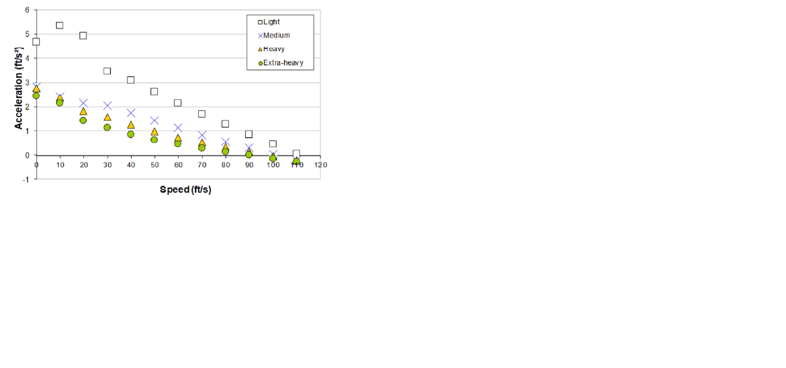
]

.panel[.panel-name[Driver model]
- Collect data:

    - Speed and Flow data on a 10km of multilane highway
    - Speed and Flow data on 16 segments of two-lane highways

- Model:

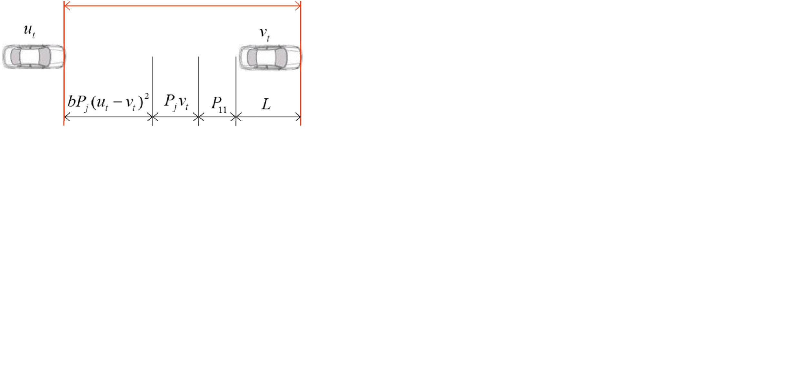
]

.panel[.panel-name[Result]
- The AG was able to calibrate parameter to four different trucks and 10 different drivers profile.

- The MAER for truck classes ranged from 4.5% to 7.5%

- The MAER for individual trucks was 2.2%

- The error ratio dropped by almost 50% using the parameter calibrated for driver behaviour

- The method reveals how to estimate percentage time spent following (PTSF) with a calibrated model
]

.panel[.panel-name[Publication]
- [2007] Araújo, J.J. ([PhD thesis](https://teses.usp.br/teses/disponiveis/18/18137/tde-06112007-172037/en.php))

- [2007] Cunha, A.L. ([Master's](https://teses.usp.br/teses/disponiveis/18/18144/tde-27112007-094400/en.php))

- [2009] [Genetic Algorithm for the calibration of
vehicle performance models of microscopic traffic simulators.](https://link.springer.com/chapter/10.1007/978-3-642-04686-5_1)

- [2011] [Truck equivalence factors for divided, multilane highways in Brazil](https://citeseerx.ist.psu.edu/viewdoc/download?doi=10.1.1.1070.4360&rep=rep1&type=pdf).

- [2017] [Evaluation of Models to Estimate Percent Time Spent Following on Two-Lane Highways](https://ascelibrary.org/doi/10.1061/JTEPBS.0000032).

]
]


---
### VISSIM Traffic Simulation Software

.panelset[

.panel[.panel-name[Details]
Developed by PTV Group in Karlsruhe, Germany. It is a microscopic multi-modal traffic flow simulation package.

- Simulation time step: 0.1s

- unlimited vehicles

- 10 driver profiles

]

.panel[.panel-name[GA]
- Coded in Python

- **30 parameters ** for each truck class
- **10 parameters ** for each driver profile

- Vehicle performance
    - used 4 truck classes
    - distribution of acceleration, power and weight

- Driver behavior
    - 10 drivers profile
    - Car-following logic
    - Lane-changing logic
    
- Fitness function
    - MAER (Mean Absolute Error)
]

.panel[.panel-name[Truck model]

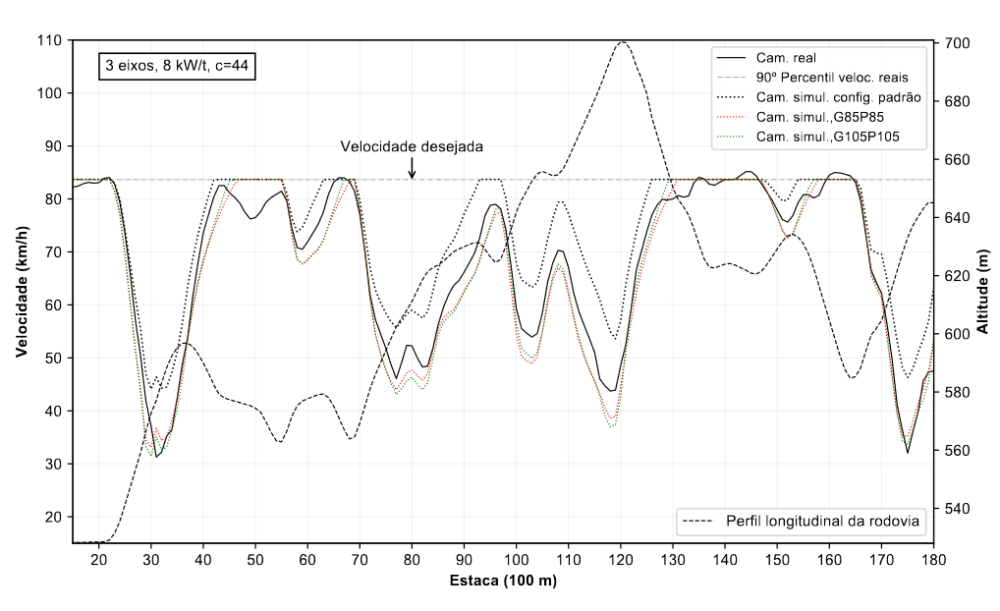
]

.panel[.panel-name[Driver model]

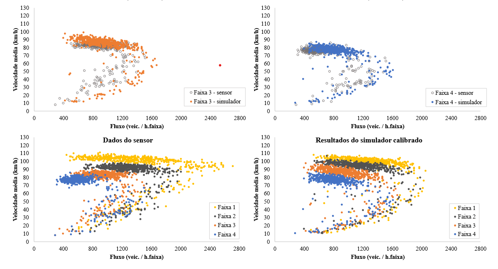
]

.panel[.panel-name[Publication]
- [2016] [Calibration of microscopic traffic simulators using macroscopic measures](https://teses.usp.br/teses/disponiveis/18/18144/tde-18072016-135825/en.php)

- [2018] [Calibration of Vissim's truck acceleration model](https://teses.usp.br/teses/disponiveis/18/18144/tde-18022019-112511/en.php)
]
]


---
class: center, middle, inverse

# Principal Component Analysis (PCA)


---
## Principal Component Analysis
.panelset[

.panel[.panel-name[Concept]
- Reducing dimensionality of data

- Preserve as much as possible the information contained in original data

- Emphasizes variation and highlights patterns in dataset


]

.panel[.panel-name[Application]
- [2016] [A Model for Estimating Free-Flow Speed on Brazilian Expressways](https://www.sciencedirect.com/science/article/pii/S2352146516305610)

- Models for estimation of FFS
    - HCM: $$FFS = BFFS - f_1 - f_2 - ... - f_n$$
    - HDM-4: $$FFS = f(V_{drive}, V_{brake}, V_{curve})$$
    - Proposed: $$FFS = f(PostSpeed, NumLanes, HwyType, AdjLandUse, HorzAlign, AccessDen)$$
]
]


---
class: center, middle, inverse

# Bayesian Inference


---
## Bayesian Inference

.panelset[

.panel[.panel-name[Concept]
- Specify how one should update one's belief upon observing data

- A method of statistical inference used to update the probability for a hypothesis as more evidence or information become available.


Image credit: [Yanagisawa](https://www.researchgate.net/publication/330577376_Modeling_Emotions_Associated_With_Novelty_at_Variable_Uncertainty_Levels_A_Bayesian_Approach)
]

.panel[.panel-name[Application]
- [2019] [A calibration method structured on Bayesian Inference of the HCM speed-flow relationship for freeways and multilane highways and a temporal analysis of traffic behavior](https://arxiv.org/pdf/1908.10852.pdf)

.pull-left[
- HCM Speed-flow model: $$u = u_f - ((u_f - \frac{q_c}{k_c}) \cdot (\frac{q - bp}{q_c - bp})^\alpha) \cdot (q \geq bp)$$
]

.pull-right[

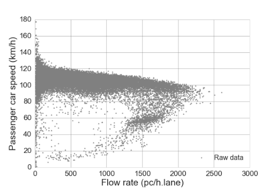
]
]
]

---
class: center, middle, inverse

# Thanks!

<alcunha@usp.br>

[https://github.com/albnc](https://github.com/albnc)

